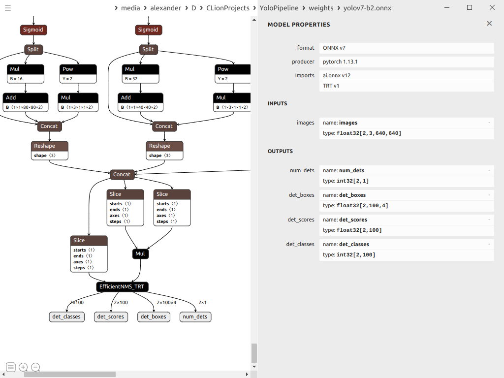

### Скачиваем репозиторий yolov7

1. Скачиваем репозиторий по [ссылке](https://github.com/WongKinYiu/yolov7)
2. Там же скачиваем модель
3. Конвертируем модель в onnx  
На данном шаге выбираем размер батча
```
python export.py --weights ./yolov7-tiny.pt \
    --grid \
    --batch-size 2 \
    --end2end \
    --simplify \
    --topk-all 100 \
    --iou-thres 0.65 \
    --conf-thres 0.35 \
    --img-size 640 640
```

После того, как была получена модель, её можно открыть в программе [netron](https://netron.app/) и убедиться,
что выход модели соответствует представленому на изображении



### Устанавливаем необходимые библиотеки
Для конвертации в trt нужно установить библиотеки cundd и tensorrt.
Рекомендуется устанавливать из tar.gz пакетов

* Установить cundd
  https://developer.nvidia.com/rdp/cudnn-download

* Установить tensorrt
  https://developer.nvidia.com/nvidia-tensorrt-8x-download

После установки прописать путь в ~/.bashrc
```
export LD_LIBRARY_PATH=$LD_LIBRARY_PATH:/usr/local/TensorRT-8.6.0.12:/usr/local/cuda-11.4/targets/x86_64-linux/lib
```

### Конвертация в trt 
Конвертация с помощью trtexec, пример:
  
```
/usr/local/TensorRT-8.6.0.12/bin/trtexec --onnx=yolov7-b2.onnx --saveEngine=yolov7-nms-b2.trt --fp16
```

Полученный файл закидываем в папку weights